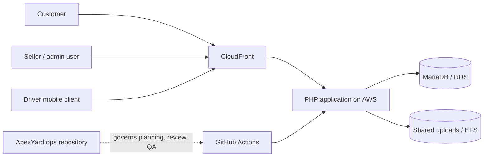

# Customer platform system context

## Boundary decision

ApexYard is an operating and review layer. GitHub Actions remains the delivery
mechanism, and AWS remains the runtime. This separation is deliberate: process
improvements can evolve without changing the production deployment channel.

## Initial review focus

- Trace storefront and seller requests through the public routing layer.
- Identify data-changing operations and their rollback requirements.
- Confirm the smoke-test surface used after a production deployment.
- Document trust boundaries around authentication, uploads, payments, and
  logistics integrations.
